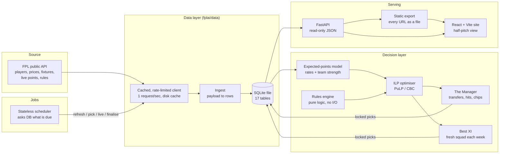

# Fantasy-Premier-League: System Design

Repo: https://github.com/MelvTheGoat/Fantasy-Premier-League

## The problem, in 3 lines

Every Fantasy Premier League (FPL) manager pays a hidden price for being stuck with last week's squad, but nobody can see that price because you only ever play one team.
This system plays the 2026/27 season with two automated teams from the same predictions: one with real limits (**The Manager**) and one rebuilt from scratch every week (**Best XI**).
The gap between their scores measures what continuity costs. Both are scored with real FPL points against the official gameweek average.

## Diagram

In production there is no server. A GitHub Actions workflow runs the scheduler about every half hour. It stores the database on a `season-data` branch and publishes the static export to GitHub Pages.

## Each part, and why it's there

| Part | Code | What it does | Why it's there |
|---|---|---|---|
| FPL API client | `data/client.py` | Fetches JSON from the public FPL API. Caches every response on disk, waits at least 1 second between requests, backs off on server errors, never retries a 4xx. | The API is public and has no login, so the client has to be polite or it gets blocked. The cache also makes re-runs cheap. |
| Ingest | `data/ingest.py` | Turns API payloads into database rows. Spots blank and double gameweeks. | Keeps the messy API shape in one place. |
| Repository | `data/repository.py` | Turns database rows into the rules engine's types. Holds the "you can't rewrite a past gameweek" check. | The rules engine never touches the database, so it can be tested without one. |
| SQLite database | `data/schema.sql` | One file with 17 tables: players, per-gameweek prices, fixtures, per-player stats, projections, locked picks, transfers, chips, results and more. | The whole season fits in megabytes. One file is easy to back up, move and store on a git branch. |
| Rules engine | `rules/` | Squad rules (2 GK / 5 DEF / 5 MID / 3 FWD, max 3 per club), formations, auto-subs, captaincy, selling prices, free transfers and hits, the two chip sets, scoring. | Rules are facts. If one is wrong, every number after it is wrong without any error showing. So it's pure logic with the most tests. |
| Scoring table | `rules/scoring_table.py` | Reads points-per-action from the API instead of hard-coding them. | Rules changed for 2026/27 (a goalkeeper goal is now worth 10). Reading them from the API means no code change is needed. |
| Player rates | `model/player_rates.py` | Per-90-minute rates for goals, assists, saves, defensive contributions, bonus points and cards, plus the chance of starting. | Early season has very little data, so each rate is pulled toward a price-based prior until the player has played enough minutes. |
| Team strength | `model/team_strength.py` | Expected goals for and against in each fixture. | FPL stopped publishing team attack/defence ratings this season, so they are rebuilt from fixture difficulty plus actual results. |
| Expected points | `model/xpts.py` | Adds up expected points per fixture from parts: appearance, goals, assists, clean sheet, goals conceded, saves, defensive contribution, bonus, cards. | Built from parts, not trained end to end. Each part can be explained on the site ("on penalties, easy home game"). |
| Projections | `model/projections.py` | Runs the model for every player over a 5-gameweek horizon and stores it, keyed by which deadline it was made before. | Both teams read the same projection, so any score gap comes from what they're allowed to do, not what they believe. |
| Optimiser | `optimise/squad.py` | Integer linear program (ILP): picks the best legal 15, the best 11 and the captain within budget. | Greedy picking fails because budget, positions and the 3-per-club limit all interact. An ILP finds the true best answer. |
| Best XI | `strategy/best_xi.py` | Runs the optimiser once per gameweek from scratch. | The "perfect freedom" baseline. |
| The Manager | `strategy/manager.py` | Asks for the best squad reachable in 0 to 5 transfers, subtracts hit costs, then decides on chips. | The "real life" team: one free transfer a week, −4 per extra, chips that expire. |
| Explanations | `strategy/explain.py` | Writes a reason for every pick and transfer. | So the site can say *why*, not just *what*. |
| Scheduler | `jobs/scheduler.py` | Every tick, reads the database against the clock and runs whatever is owed: seed, refresh, pick, live, finalise, score, catch-up. | It keeps no memory between runs. A restart or a missed run just means the work is still due. |
| Jobs + CLI | `jobs/`, `cli.py` | Every scheduled job is also a command (`fplai pick`, `fplai live`, ...). | Makes every step easy to run and debug by hand. |
| HTTP API | `api/app.py`, `api/views.py` | Read-only FastAPI: gameweeks, a model's gameweek, a model's season, player detail, summary. | The models run as jobs. The API only serves what they decided, so a slow request can never delay a deadline. |
| Static export | `jobs/export.py` | Calls the API for every URL the frontend can ask for and saves each answer as a `.json` file. | Lets the site run on GitHub Pages with no server. Because it goes through the real API, the static copy can't drift from it. |
| Frontend | `frontend/` (React 18, Vite 5) | Half-pitch squad view, two tabs (one per model), gameweek picker, player detail sheets, season chart. | The part people actually look at. |
| GitHub Actions workflow | `.github/workflows/season.yml` | Runs at :07 and :37 past each hour. Restores the database, runs `fplai schedule --watch`, prunes, stores the database, builds and publishes the site. | A free "server" that only needs to think a few times a day. |

## Tech stack

| Tool | What it's used for | Why this one |
|---|---|---|
| Python 3.11 | All backend logic | Standard for data work. The model is plain arithmetic, so no heavy libraries are needed. |
| httpx | Calling the FPL API | Simple HTTP client with timeouts. |
| SQLite | The whole season's record | One file, no server, easy to back up and store on a git branch. Enough for one writer. |
| PuLP + CBC | Solving the squad ILP | Free, well-known, and solves a ~667-player problem in well under a second, per the code comments (30 s time limit). |
| FastAPI + Uvicorn | Read-only JSON API | Small, fast to write, easy to test with its test client. |
| React 18 + Vite 5 | Frontend | Small component tree, fast build, dev proxy to the API. |
| pytest, ruff | Tests and lint | 610 tests pass locally in about 43 seconds with no network. |
| GitHub Actions + Pages | Running jobs and hosting the site | Free for public repos. The site is read-only, so no always-on server is needed. |
| Docker, Render blueprint | Other ways to deploy | Same code as one container with a persistent `/data` disk, if an always-on host is wanted. |

The backend has **only four runtime dependencies**: fastapi, uvicorn, httpx, pulp. No pandas, numpy or scikit-learn. `pyproject.toml` says this on purpose: the projection is arithmetic, not a fitted model.

## Data flow, step by step

1. **Seed (first run only).** `fplai seed` runs refresh → history → results → backfill → score. Each step is skipped if already done, so an interrupted seed resumes where it stopped.
2. **Refresh.** Pull players, teams, prices and fixtures from the API. Save a price snapshot *for this gameweek* in `player_prices`.
3. **History.** One request per player for price history and past seasons. This is the slow one (1–10 minutes), paced at 1 request/second, and it only needs running once.
4. **Project.** For each player, build rates (shrunk toward a price-based prior), estimate the chance of starting, work out expected goals for/against per fixture, then add up expected points per fixture across the next 5 gameweeks.
5. **Pick (inside 8 hours before a deadline).**
   - Best XI: run the optimiser on this gameweek's points.
   - Manager: decide on a chip, then try 0 to 5 transfers. Keep the option with the most points after hits. A hit must beat 4 points plus a 2-point safety margin.
   - Save both as `locked_picks`. They can be refined until the deadline. After the deadline, any rewrite raises `LockedPicksExist`.
6. **Live.** During matches, poll live points and apply automatic substitutions.
7. **Finalise.** After 09:00 UK time the day after the gameweek's last match, store final points and the official average.
8. **Score.** Work out each model's gameweek score (captain, auto-subs, hits) and whether it beat the average. If the results behind a score are newer than the score itself, re-score.
9. **Prune.** Delete lookahead projections for gameweeks already past (most of the database).
10. **Publish.** Gzip the database and force-push it to `season-data` as one commit. Upload a 30-day artifact backup. Export every API URL as JSON, build the React app, deploy to Pages.

## Trade-offs and limits

**Choices I made on purpose**
- **Hand-built model instead of a trained one.** Early in a season there isn't enough data to fit anything better. The cost: the weights are reasoned, not tuned, and there's **no backtest on a past season**, so the model's accuracy is not measured in the repo yet.
- **SQLite, one writer.** Simple and cheap. It means exactly one instance can run. The workflow's `concurrency: season` setting stops two runs at once.
- **GitHub Actions as the server.** Free, but GitHub's cron is best-effort. The workflow comments record gaps of 2–7 hours between runs. The fix: an 8-hour pick window, and a run inside that window stays alive (up to 4 hours) until the deadline.
- **Database stored as a single force-pushed commit.** Keeps the repo small. The real backup is the 30-day artifact.
- **Bench weighted at 0.12, not 0.** A bench worth nothing gives you four £4.0m players who never play.

**Known limits (from the code and docs)**
- **Team news leaks into backfilled gameweeks.** The API has no history of `status` or `chance_of_playing`, so a squad rebuilt for GW1 today knows about later injuries. Prices, results and projections are time-boxed. Team news is not.
- **Chip thresholds are corrections, not validated values.** They were raised when the minutes model was fixed (now 22 / 12 / 18 / 30 for Bench Boost / Triple Captain / Free Hit / Wildcard).
- **Blank and double gameweeks are only tested on made-up fixtures.** None had happened this season when the code was written.
- **No effective ownership.** The models don't know what other managers own, so "beat the average" is measured but never aimed for.
- **Docs have drifted from code.** The README says ~490 tests, `how-it-works.md` says 574, and 610 pass today. The docs list older chip thresholds (16/10/12/20) and "0–3 transfers", but the code uses 22/12/18/30 and 0–5.
- **Small unused bit:** `BENCH_SLOT_WEIGHTS` is defined in `optimise/squad.py` but never used.

**Results so far (from the `season-data` database, 28 Sep 2026)**

| | Manager | Best XI |
|---|---|---|
| Points, GW1–5 | 268 | 322 |
| Beat the official average | 1 of 5 (GW5) | 2 of 5 (GW2, GW3) |
| Transfers / hits | 5 transfers, one −4 hit (GW3) | n/a |
| Chips played | none yet | n/a |

Five gameweeks is far too few to judge either model. Also, GW1–4 were re-picked on 17 Sep right after a model fix, so GW5 is the only fully live week so far.

## What I'd change at 10x scale

"10x" could mean two things here.

**10x more visitors.** Nothing changes. The site is static files on Pages, which a CDN serves.

**10x more work, e.g. picking for 10+ real user teams, or many strategy variants.**
- **Move from SQLite to Postgres.** Many writers would need real concurrency. SQLite's single-writer rule is fine only for one job at a time.
- **Move jobs off GitHub Actions** onto a real scheduler and a job queue (e.g. a worker pool). Best-effort cron isn't safe when many deadlines matter.
- **Run the optimiser in parallel.** Each solve is fast, but the Manager does up to 6 solves (0–5 transfers) plus chip checks. With many teams, run them across workers.
- **Share the projection.** The projection is the same for every team, so compute it once per deadline and reuse it. Only the optimiser runs per team.
- **Add a backtest and model versioning.** `MODEL_VERSION = "rates-v1"` exists. With more users I'd need to prove each new version beats the old one on a past season before switching.
- **Record team news every gameweek** to close the one leak for future seasons.
