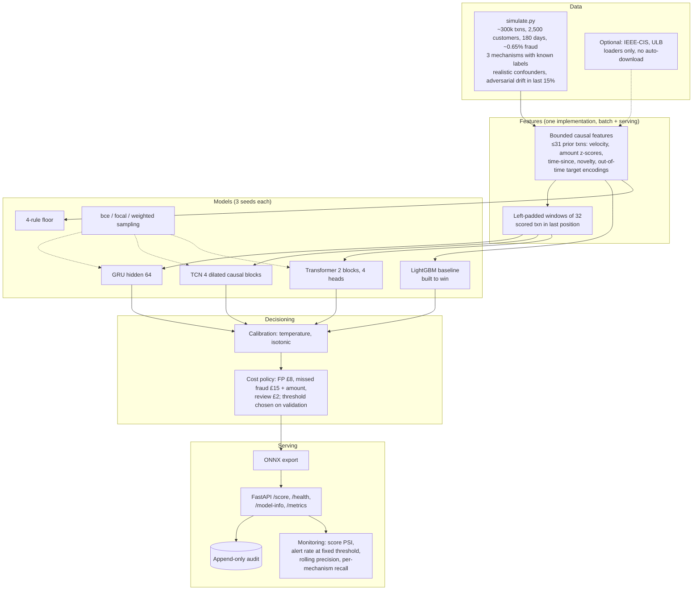

# Fraud-Detection-With-Sequence-Models: System Design

Repo: https://github.com/MelvTheGoat/Fraud-Detection-With-Sequence-Models

> The repo arrived as **one commit** (7 Aug 2026). The results numbers below come from its README and DECISIONS.md. The `results/` folder isn't committed (only `.gitkeep`), so I couldn't check them against saved outputs. Reproducing them means running `make experiment` (CPU training of 11 model arms × 3 seeds).

## The problem, in 3 lines

Card fraud rarely shows in one transaction. It shows in the *pattern*: nine tiny payments in four minutes, a sudden break from a customer's normal spending.
Gradient-boosted trees are the default for fraud and are hard to beat on flat feature tables.
This project measures honestly whether sequence models (GRU, TCN, Transformer) over a customer's recent transactions beat a deliberately strong LightGBM baseline, including after the fraudsters adapt, and serves the winner in real time.

## Diagram

## Each part, and why it's there

| Part | Code | What it does | Why it's there |
|---|---|---|---|
| Simulator | `src/simulate.py` | Card testing, account takeover and merchant compromise, with known labels. Confounders: multiple devices, legitimate bursts, travel, large one-offs, attackers reusing the victim's device, 4% undisputed fraud. Adversarial drift in the final 15%. | No public dataset says which attack caused which fraud, so "which mechanism is this model blind to?" can't be answered without it. |
| Loaders | `src/data/loaders.py` | Synthetic plus optional IEEE-CIS and ULB (manual download only). | The real datasets lack keys that sequence models need, and the loaders say so. |
| Features | `src/data/features.py` | Per-customer causal features over ordered arrays, bounded to 31 prior transactions. **The same function is used offline and online.** | Online/offline parity. A request can't carry unbounded history. |
| Sequences | `src/data/sequences.py` | Left-padded windows, masks, weighted sampling. | Model input. |
| Splits | `src/data/splits.py` | Temporal train/val/test with a one-day embargo. | No leakage across the split boundary. |
| Baselines | `src/baselines.py` | LightGBM with velocity windows, z-scores, time-since, novelty flags, out-of-time target encodings, native categoricals. Plus a 4-rule floor. | A strong baseline makes the comparison meaningful. |
| Models | `src/models/*` | One shared encoder (embeddings capped at 16 dims, rare merchants share a row). GRU, TCN (causal by construction), Transformer (causal + padding mask). The prediction is read at the last position. | The same causal contract for all three. |
| Training | `src/train.py` | Early stopping on validation PR-AUC. bce vs focal vs weighted sampling. 3 seeds. | Fair, repeated comparison. |
| Evaluation | `src/evaluation.py` | PR-AUC, precision/recall at capacity (0.1/0.5/1%), per-mechanism recall. Accuracy shown only next to "never fraud". | The metrics a fraud team uses. |
| Calibration | `src/calibration.py` | Brier, quantile ECE, alert-region calibration, temperature and isotonic. | Aggregate ECE hides errors in the decision band. |
| Policy | `src/policy.py` | Expected cost per transaction. Threshold picked on validation, applied to test, **per seed**. FP cost swept from £2 to £30. | Decisions are about money. |
| Explain | `src/explain.py` | Attention weights, gradient attributions, TreeSHAP, with caveats. | Points analysts at related activity. |
| Monitoring | `src/monitoring.py` | Score PSI, alert rate at a fixed threshold, rolling precision, per-mechanism recall. | Tested against the injected drift. |
| Serving | `src/api/*` | ONNX export, FastAPI, audit log written before the response, latency benchmark, live metrics. | p99 budget ≤ 50 ms. |
| Tests | `tests/*` | Leakage (scramble or delete the future, flip labels, a detector with teeth), serving parity, a metric regression gate, models, monitoring. | The most dangerous bugs here are silent. |

## Tech stack

| Tool | What it's used for | Why this one |
|---|---|---|
| PyTorch (CPU) | GRU, TCN, Transformer | Standard deep learning |
| LightGBM | Baseline | The default for tabular fraud |
| pandas, numpy, pyarrow | Data | Standard |
| scikit-learn | Isotonic, metrics | Standard |
| ONNX + onnxruntime | Serving | 2.8× faster forward pass than eager PyTorch (README) |
| FastAPI + Uvicorn | Scoring API | Simple and fast |
| SHAP | Tree explanations | Exact TreeSHAP |
| pytest, ruff, mypy | Quality | Leakage tests matter most |
| Docker Compose | Deployment | Artifacts mounted read-only |

## Data flow, step by step

1. Simulate about 297k transactions (0.63% fraud). Split by time: train to 18 Apr, validation to 15 May, test to 29 Jun, with drift starting 3 Jun.
2. Build bounded causal features and 32-length windows.
3. Train LightGBM, the rules, and 9 sequence arms (3 architectures × 3 imbalance strategies), each with 3 seeds.
4. Calibrate on validation (temperature, isotonic) and measure on test, including the alert region.
5. Choose a cost-minimising threshold on validation per seed, and apply it to test.
6. Export the chosen model to ONNX and serve it.
7. **At scoring time:** the request carries the transaction plus 62 prior transactions → shared feature code → ONNX → isotonic → threshold → decision, top contributing prior transactions and model version → audit → response.
8. Monitor alert rate, PSI and rolling precision per window.

## Trade-offs and limits

**Reported results (README, 3 seeds, synthetic):**
- PR-AUC: best GRU 0.870 ± 0.014 vs LightGBM 0.826 ± 0.001 (~3σ).
- **Pre-drift they're tied** (LightGBM 0.956 vs GRU 0.950). **Post-drift** GRU 0.765 vs LightGBM 0.615.
- Card-testing recall 0.92 vs 0.84, where ordering *is* the evidence.
- **Cost per transaction: 0.0799 ± 0.0122 vs 0.0860 ± 0.0035. Not significant.**
- The GRU (78k params, ~2 min) beats the Transformer (106k, ~5 min).
- Latency: p99 end-to-end 7.2 ms vs a 50 ms budget. Features cost more than the model.
- Score PSI never fired (peak 0.0011). The alert-rate ratio caught the drift in the first affected window.

**Limits:**
- One synthetic world and one drift, designed by the same author as the models.
- Only 3 seeds, which can't resolve a 7% cost gap.
- ~1,137 fraud examples in training, so the Transformer is capacity-starved.
- Recall is per transaction, not per attack episode (optimistic).
- Bounded 31-transaction history gives up long-horizon signal.
- Assumed costs (£8 per false positive).
- No fairness evaluation possible (no demographic attributes).
- Results aren't committed, so numbers can't be checked without re-running.

**In progress (Oct 2026, unmerged branch, `deploy/`):** a public demo over the unmodified scoring API. `deploy/app.py` adds `/` and `/demo/*` routes to the existing app, so the page calls the production `/score`. A visitor picks a real test-period customer history (the request needs 62 prior transactions) and edits only the candidate transaction.

Hosting: a Docker image with the bundle baked in (2.01 GB image, 290 MiB resident, verified under a 512 MB limit), a Hugging Face Space script, and a Render blueprint on a `deploy-render` branch that carries the model files. Measured on Render: 0.5 CPU meets the 50 ms budget (blocked p50 14.0 ms); the free 0.1 CPU misses it (p99 1,519 ms, 124 s cold start).

A static route runs the same ONNX graph in the browser with ONNX Runtime Web over 150 precomputed scenarios, matching the server to within 3e-07. Not merged, no public URL yet.

## What I'd change at 10x scale

- **A feature store** sharing the same feature code, for long-horizon history instead of a 31-transaction cap.
- **Streaming ingestion** (e.g. Kafka) with per-customer state, and batched ONNX inference.
- **Graph features or models** for merchant compromise (a cross-customer pattern).
- **Episode-level evaluation** and 10+ seeds before a cost claim.
- **Champion/challenger** with shadow scoring, and alert-rate-based drift alarms.
- **Delayed-label pipelines** that join chargebacks weeks later for retraining.
