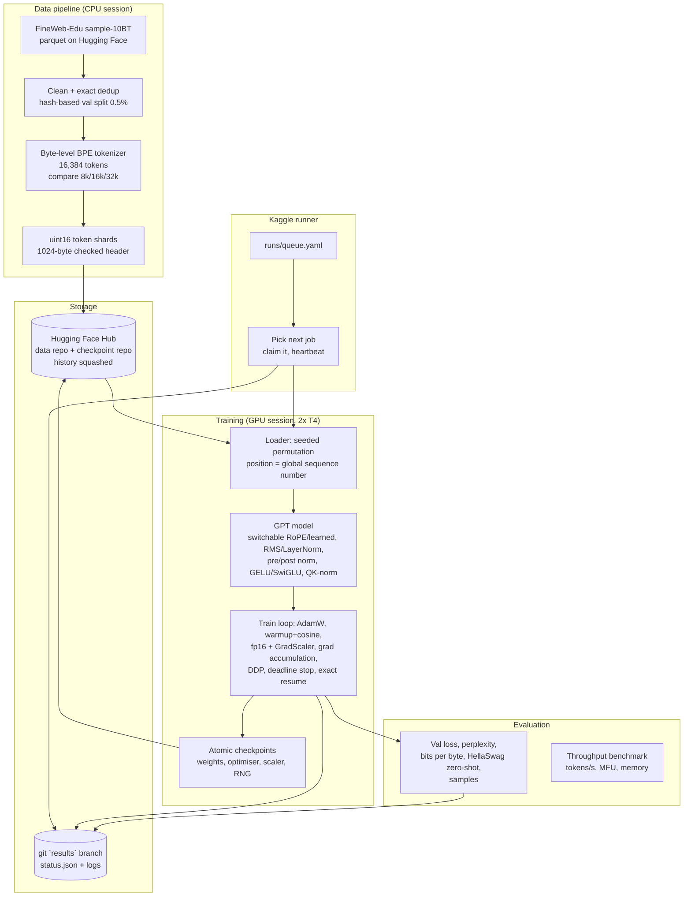

# LLM (gptlab): System Design

Repo: https://github.com/MelvTheGoat/LLM

> **Status:** the code for data, model, training, evaluation and the Kaggle job runner is written and tested. **The GPU smoke test passed on 2× T4 on 7 October 2026** (`results/smoke-2` on the `results` branch), and `EXPERIMENTS.md` now holds the measured speeds and the compute budget (about 46 GPU hours). **Experiments A–E haven't run yet**, so there are no loss curves, scaling fits or HellaSwag scores.

## The problem, in 3 lines

Most people use large language models but can't explain how one is actually trained.
This project trains small GPT-style models (about 1M to 100M parameters) from scratch in PyTorch on free hardware, and is set up to run real experiments: scaling laws, architecture ablations, training stability and speed.
The engineering challenge is doing it on free Kaggle GPUs (2× T4) that shut down after a time limit, without losing work.

## Diagram

## Each part, and why it's there

| Part | Code | What it does | Why it's there |
|---|---|---|---|
| Config | `config.py` | Strict YAML configs for model, data, train and eval. Each run saves its resolved config and git commit. | Any result can be re-run exactly. |
| Data source | `data/sources.py` | Reads FineWeb-Edu parquet files in blocks of ~1,000 documents in a seeded random order. | The files store long runs from the same crawl. Shuffling blocks mixes crawls in every shard. |
| Cleaning | `data/clean.py` | Unicode NFC, trims whitespace, drops too-short/too-long/broken/mostly-non-letter pages, removes exact duplicates by hash. Counts every drop with its reason in `manifest.json`. | FineWeb-Edu is already filtered, so cleaning stays light and cheap. |
| Train/val split | `data/clean.py` | 0.5% of documents go to validation, chosen by a hash of the text. | The same document always lands in the same split, so duplicates can't leak across. |
| Tokenizer | `data/tokenizer.py` | Byte-level BPE, 16,384 tokens, trained on training docs only. The data job also compares 8k/16k/32k on bytes per token. | 32k would put most of a tiny model's parameters into the embedding and output layers. |
| Shards | `data/shards.py` | uint16 token files with a 1,024-byte header (magic, version, count). Read with numpy memory-mapping. | Small on disk (2 bytes/token). A broken file is caught on open. |
| Loader | `data/loader.py` | Cuts shards into `seq_len + 1` blocks and reads them in a seeded permutation. Position is one counter. | Exact resume needs only the step number, and 1-GPU and 2-GPU runs read the same data per step. |
| Model | `model.py` | Decoder-only transformer. Switches for position encoding, norm type and placement, MLP type, weight tying and QK-norm. GPT-2 init with scaled residual projections. Fused `scaled_dot_product_attention`. Optional z-loss. | Every switch is a planned ablation. |
| Optimiser + schedule | `optim.py` | AdamW with weight decay only on 2D tensors. Fused on CUDA. Linear warmup, then cosine/linear/constant decay. | Standard, well-understood choices. |
| Training loop | `train.py` | fp16 autocast + GradScaler, gradient accumulation, clipping, DDP with `no_sync` on non-final micro-batches, optional `torch.compile`, deadline stop, JSONL step logs, per-layer debug stats. | T4s have no bfloat16, so fp16 needs a loss scaler. The deadline stop protects work from Kaggle's time limit. |
| Checkpoints | `checkpoint.py` | Saves weights, AdamW state, scaler, data position and every process's RNG state. Writes to `.tmp` then renames. | A crash mid-save can't corrupt the last good checkpoint. Resume is bit-exact. |
| FLOPs and MFU | `flops.py` | 6N per token plus the attention term (12·layers·T·d). MFU = achieved FLOPs ÷ GPU peak. Checked against PyTorch's FLOP counter. | Tells you how much of the hardware you actually use. |
| Evaluation | `evaluate.py`, `hellaswag.py` | Val loss, perplexity, bits per byte, zero-shot HellaSwag (acc and acc_norm, lm-eval-harness prompt format), sample text. | Bits per byte compares across tokenizers. HellaSwag is a standard small-model benchmark. |
| Benchmark | `bench.py` | Tokens/s, MFU and memory across model sizes, precision, compile and GPU count. Auto-finds the largest micro-batch that fits. | For the planned efficiency experiment. |
| Hub storage | `hub.py` | Uploads data and checkpoints. Keeps only `latest/` and `final/`, and "super-squashes" repo history. | Free Hub storage grows with every file version, so history is rewritten to one commit. |
| Results branch | `runner/results.py` | Writes `results/<job>/status.json` + logs to a git branch. Fetch, reset, copy own folder, commit, push, and repeat on conflict. | Several Kaggle sessions can push safely at the same time. |
| Job queue | `runner/queue.py`, `runs/queue.yaml` | Jobs with states: running, paused, done, diverged, failed. Picks the first job that can run on this hardware. | One notebook works through all experiments across many sessions. |
| Runner | `runner/run.py`, `kaggle/runner.ipynb` | Claims a job, downloads data/checkpoint, trains with a background uploader and heartbeat, stops before the 11-hour limit, pushes logs. | Turns free, time-limited sessions into one long, resumable job system. |

## Tech stack

| Tool | What it's used for | Why this one |
|---|---|---|
| PyTorch (≥2.3) | Model, training, DDP, fused attention, compile | Written from scratch on plain PyTorch, not a training framework |
| `tokenizers` | Fast BPE training | Written in Rust. Much faster than a Python BPE on a billion characters. |
| numpy | Memory-mapped token shards | Cheap random access |
| pyarrow | Reading parquet | FineWeb-Edu ships as parquet |
| huggingface_hub | Data and checkpoint storage | Free, large storage for public repos |
| PyYAML | Configs | Readable, one file per run |
| matplotlib | Plots (planned) | For the write-up |
| pytest | Tests | Run on CPU in under a minute (README) |
| Kaggle (2× T4) | Free GPUs | fp16 only, 16 GB each |

## Data flow, step by step

1. **Data job (CPU session):** read 4 FineWeb-Edu parquet files (~2.9M documents) in a shuffled block order → clean and dedupe → split by hash (0.5% val) → train the 16k BPE (and compare 8k/16k/32k) → encode → write 100M-token uint16 shards (~2.6B train tokens, ~5.2 GB) → upload to the Hub with `manifest.json`.
2. **Job pick:** the notebook runs `python -m gptlab.runner`, reads statuses from the `results` branch, and claims the first runnable job in `runs/queue.yaml`.
3. **Setup:** download shards and the latest checkpoint (if resuming).
4. **Train step:** set LR → for each micro-batch, forward under fp16 autocast and backward on the scaled loss (DDP syncs only on the last one) → unscale → clip → AdamW step (skipped if overflow) → log.
5. **Periodically:** validation loss, per-layer debug stats, atomic checkpoint → background upload + heartbeat.
6. **Deadline:** stop 20 minutes before the 11-hour session limit, save, mark "paused". The next session resumes it.
7. **Finish:** final eval (val loss, perplexity, bits per byte, HellaSwag, samples), save final weights, delete `latest/`, squash Hub history, mark "done".

## Trade-offs and limits

- **Free hardware shapes everything.** T4s mean fp16 plus a loss scaler (no bf16), small models, and session limits. That's why exact resume, atomic checkpoints and deadline stops exist.
- **Only the smoke test has run on a GPU.** It measured speed: compiled fp16 on 2× T4 runs from about 625k tokens/s (s1, 2.9M params) to about 37k tokens/s (s6, 97.5M), with MFU of 11–20% against the T4's fp16 peak. `torch.compile` is 1.5–2.6× faster, fp16 is 2.7× faster than fp32, and 2 GPUs are 1.74× one GPU. Experiment loss, perplexity and HellaSwag are **not measured yet**, and the full dataset hasn't been built yet.
- **The first smoke run hung for 12 hours** (data workers forked from a process with live download threads, and deadlocked), costing about 12 of the 30 weekly GPU hours. Fixed with `spawn` workers that fail loudly, and the runner now stops jobs that go silent for 30 minutes or pass their time limit.
- **Resume on GPU isn't bit-exact**, because some GPU kernels sum in a varying order. Over 200 steps, a stop-and-resume differed by at most 0.0121 in loss, against 0.0137 between two identical uninterrupted runs. So the resume adds nothing beyond run-to-run noise.
- **Small models will score near chance on HellaSwag** (25% random). Useful as a trend across sizes, not as an absolute score.
- **2.6B training tokens** is sized for a compute-optimal ~100M model with no repeats (per the data config). Bigger models would need more data.
- **Exact dedup only.** Near-duplicates across crawls aren't removed (FineWeb removes them within a crawl).
- **git branch as a results database** is simple and free, but pushes can conflict. Handled by fetch-reset-retry.
- **Hub history squashing** deletes old checkpoints for good. That saves space but gives no rollback beyond `latest`.
- **`REPORT.md` doesn't exist yet.** It's filled in as experiment runs finish. `EXPERIMENTS.md` now exists, with the plan and budget.

## What I'd change at 10x scale

For 10x bigger models (up to ~1B parameters) or 10x more experiments:
- **Better GPUs with bf16** (A100/H100): no loss scaler, and far higher FLOPs.
- **FSDP or ZeRO** instead of plain DDP, so optimiser state is split across GPUs.
- **More data:** ~20 tokens per parameter means ~20B tokens for 1B params. Near-dedup (MinHash) across all crawls.
- **A proper experiment tracker** (e.g. Weights & Biases or MLflow) instead of a git branch.
- **Object storage** (S3/GCS) for checkpoints, with versioning instead of history squashing.
- **A cluster scheduler** (e.g. Slurm or Kubernetes jobs) instead of a YAML queue claimed by notebooks.
- **Flash-attention kernels** and sequence packing, to push MFU up.
