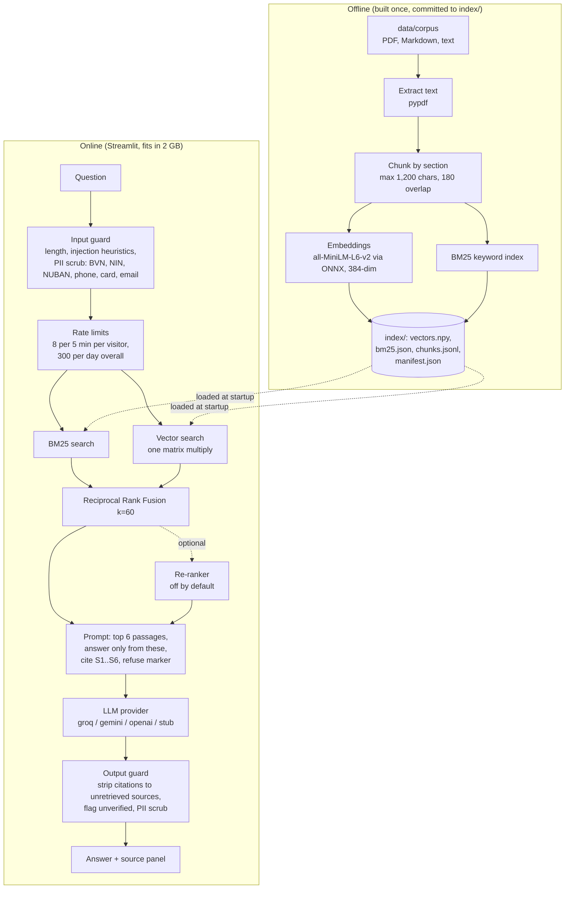

# Nigerian-Fintech-Compliance-RAG: System Design

Repo: https://github.com/MelvTheGoat/Nigerian-Fintech-Compliance-RAG

## The problem, in 3 lines

Nigerian fintech rules are spread across CBN circulars, the Nigeria Data Protection Act 2023 and NDPC directives. They're PDFs on different sites that refer to each other and change quietly.
A simple question like "how fast must we report a data breach?" can have two correct answers (one for the NDPC, one for the CBN).
This app answers questions in plain English using only the indexed documents, cites every claim, shows the exact passage underneath, and refuses when the documents don't cover it.

> **Important:** the repo ships **six written summaries**, not the real regulation. Some thresholds are out of date (e.g. 2013 KYC tier limits). The official PDFs couldn't be downloaded from the build environment. `MANUAL_SOURCES.md` lists them.

## Diagram

## Each part, and why it's there

| Part | Code | What it does | Why it's there |
|---|---|---|---|
| Corpus fetch | `scripts/fetch_corpus.py` | Downloads the official CBN/NDPC PDFs. On failure, logs it and writes `MANUAL_SOURCES.md` with URLs and destinations. | The build environment couldn't reach `.gov.ng`. It fails loudly and helpfully. |
| Extract | `src/ingest/extract.py` | PDF (pypdf), Markdown and text to text, keeping section structure and metadata (issuer, date, authoritative flag). | Citations need section numbers and titles. |
| Chunking | `src/ingest/chunking.py` | Section-based chunks, max 1,200 chars, 180 overlap. 100 chunks from 6 documents. | Legal text is organised by section, so a chunk should be one clause. |
| Embedder | `src/retrieval/embedder.py` | `all-MiniLM-L6-v2` run with `onnxruntime` + `tokenizers` (no PyTorch). A hashing fallback for tests. | PyTorch alone costs 350–450 MB of RAM. ONNX gives the same vectors much more cheaply. |
| Vector store | `src/retrieval/store.py` | A plain numpy array. Search is one matrix multiply. | No vector DB needed at this size (or 100× it). |
| BM25 | `src/retrieval/bm25.py` | Keyword ranking. | Regulations use exact terms ("Tier 1", "72 hours", "N5,000,000"). |
| Fusion | `src/retrieval/fusion.py` | Reciprocal Rank Fusion with k=60. | BM25 and cosine scores aren't comparable. Ranks are. |
| Re-ranker | `src/retrieval/rerank.py`, `scripts/export_reranker.py` | Optional cross-encoder on the shortlist. Off by default. Falls back with a warning if the weights are missing. | Might improve ranking. Its quality gain is **not measured**. |
| Prompts | `src/generation/prompts.py` | Passages as [S1]..[S6]. Answer only from them, cite inline, never invent markers, emit a refusal marker if unsupported. | Makes grounding and refusal checkable. |
| Providers | `src/generation/providers.py` | groq, gemini, openai, or a `stub` that quotes passages. | Runs free with no key. CI uses the stub. |
| Input guard | `src/guardrails/input_guard.py`, `pii.py` | Length cap (600), prompt-injection heuristics, and PII scrubbing *before* any third-party call. | Protects personal data and the API quota. |
| Output guard | `src/guardrails/output_guard.py` | Strips citations to unretrieved sources and labels those claims unverified. Scrubs PII again. | Invented citations become visible, not silent. |
| Limits | `src/limits.py` | Per-session and daily caps, with the daily counter persisted to disk. | Free-tier protection. |
| Feedback | `src/feedback.py` | Records thumbs up/down. | Future improvement signal. |
| App | `app.py` | Streamlit UI with answer, sources, warnings on sample documents, and a cold-start notice. | Simple and deployable. |
| Eval | `eval/` | 60 questions (50 answerable with labelled sections, 10 that should be refused). Retrieval and generation scored separately. | Honest, reproducible measurement. |
| Memory check | `scripts/check_memory.py` | Measures peak RSS for the deployed setup. | Proves it fits in 2 GB. |

## Tech stack

| Tool | What it's used for | Why this one |
|---|---|---|
| Python 3.10–3.12 | Everything | CI matrix |
| Streamlit | UI | Fastest way to a usable page |
| onnxruntime + tokenizers | Embeddings (and optional re-ranker) | Same model, a fraction of PyTorch's memory |
| numpy | Vector search | One matmul |
| Custom BM25 | Keyword search | Tiny, no dependency |
| pypdf | PDF extraction | Pure Python |
| httpx | LLM provider calls | Simple |
| Groq (free tier) / Gemini / OpenAI | Answer writing | Pluggable. A free key is enough. |
| pytest, ruff, mypy | Quality | 110 tests pass, with no network or key |
| Docker, GCP Cloud Run | Deployment | `DEPLOY.md` |

## Data flow, step by step

1. **Offline:** extract the 6 documents, chunk by section (100 chunks), embed with ONNX MiniLM, build BM25, write `index/` with a manifest (build date, settings). Committed, so a deploy never rebuilds.
2. **Question arrives:** length check, injection heuristics, PII scrub, rate limits.
3. **Search:** BM25 and vector search run over the same chunks.
4. **Fuse:** RRF (k=60) merges the two rankings. Optional re-rank.
5. **Prompt:** the top 6 passages, labelled S1–S6, with strict rules (answer only from these, cite each claim, refusal marker if unsupported).
6. **Generate:** with the chosen LLM provider (or the stub).
7. **Check the output:** remove any citation to a passage that wasn't retrieved and mark the claim unverified. Scrub PII.
8. **Show:** the answer, then every cited passage in full, with a warning if the source isn't authoritative.

## Trade-offs and limits

**Measured (I re-ran `python eval/run_eval.py`, and the numbers match the repo):**

| Retrieval (50 labelled questions) | Value |
|---|---|
| recall@1 / @5 / @10 | 0.710 / 0.960 / 0.980 |
| hit@5 / hit@10 | 0.980 / 1.000 |
| MRR | 0.842 |

| Generation (stub model, lexical judge) | Value |
|---|---|
| Groundedness / citation validity | 1.000 / 1.000 (near-tautological with a quoting stub) |
| Key-fact recall | 0.726 (a floor) |
| Correct refusals (10 off-topic) | 0.400 (the stub, not a real model) |
| False refusals | 0.060 |

- **Real-LLM answer quality is not measured in the repo.** The committed results use the stub.
- **Documents are sample summaries**, paraphrased, some stale. Not for real use until they're replaced.
- **No cheap off-topic detector.** Retrieval scores for off-topic (0.42–0.67) and on-topic (0.35–0.79) questions overlap. A cutoff that catches 90% of off-topic questions rejects 26% of fair ones, so refusal is left to the LLM.
- **The semantic model adds less than expected:** MRR 0.842 vs 0.820 with a hashing stand-in, and recall@5 0.960 vs 0.900. Keyword search does most of the work on this corpus.
- **Abbreviations** (e.g. "CISO") can defeat both searches with the fallback embedder.
- **PII detection is pattern-based.**
- **Rate limits are per container.**
- **Memory:** peak ~225 MB (367 MB with the re-ranker) against 2 GB.

## What I'd change at 10x scale

For 10x the documents (e.g. all CBN circulars) or 10x the users:
- **Real, authoritative PDFs** with a scheduled re-fetch and diff, so the index knows when a rule changed.
- **Still no vector DB up to ~100× this size.** Beyond that, use an ANN index (FAISS/HNSW).
- **Shared rate limits and counters** (Redis) across replicas, and durable feedback storage.
- **Abbreviation/synonym expansion** (a glossary: CISO, PSP, PSB, BVN...) before BM25.
- **Evaluate with a real LLM and a semantic judge**, and measure the re-ranker's effect.
- **Version the index per document date**, so answers can say "as of".
- **A cross-reference graph** between regulations, so linked clauses are retrieved together.
