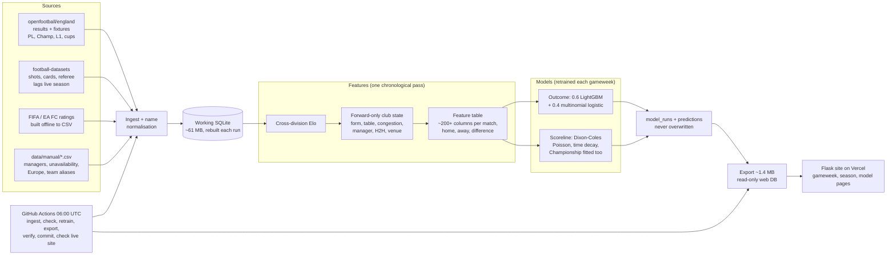

# Premier-League: System Design

Repo: https://github.com/MelvTheGoat/Premier-League

## The problem, in 3 lines

A league table says what happened, not the situation a match is played in: a tired squad after a European trip, a new manager, a club with nothing left to play for.
This system predicts every Premier League match each gameweek (home/draw/away probabilities plus a scoreline), turning every contextual signal into a feature rather than a hand-made rule.
It retrains after every gameweek, keeps a public record of every forecast it made, and publishes a small website automatically.

## Diagram

## Each part, and why it's there

| Part | Code | What it does | Why it's there |
|---|---|---|---|
| openfootball reader | `data/sources/openfootball.py` | Parses results, fixtures, gameweeks and kick-off times for PL, Championship, League One, FA Cup and EFL Cup from a public git repo (cloned once, then `git pull`). | Free, current, no key. The one source needed to predict. |
| Match stats | `data/sources/footballdata.py` | Shots, shots on target, corners, fouls, cards, referee. | Better form signals. Optional, and lags the live season. |
| Squad ratings | `data/sources/fifa_ratings.py`, `scripts/build_squad_ratings.py` | Aggregates FIFA/EA FC player dumps into one club-per-season CSV (overall, attack, midfield, defence), standardised within season. | Quality on paper for promoted or rebuilt sides. |
| Manual data | `data/manual/*.csv` | Manager spells (2025-26 on), unavailability (ships empty), European participation, team aliases. | Context you can't derive from results. |
| Team names | `data/teams.py` | Normalises club names across sources. | Different sources spell clubs differently. |
| Ingest | `data/ingest.py`, `db.py` | Loads everything into SQLite. | One store for all later steps. |
| Elo | `features/elo.py` | One rating scale across PL, Championship, League One and cups. K=20, home advantage 60, 25% regression to the mean between seasons, division offsets (Champ −180, L1 −320). | Solves the promoted-club problem: form carries across divisions. |
| Club state | `features/state.py` | Rolling per-club state that only moves forward. | Features can't see the future. It's structural, not a filter. |
| Feature build | `features/build.py` | One chronological pass. Each match's features come from the state before its gameweek's **first** kick-off. Families: strength, form (4/6/10), table context, congestion, manager, availability, squad quality, H2H, venue, season shape, each as home, away and difference. | Training and serving see the same information. |
| Outcome model | `models/outcome.py` | 0.6 × LightGBM (early-stopped on a chronological tail) + 0.4 × multinomial logistic regression on a compact core. Optimises log loss. | The booster finds interactions. The linear model is better calibrated early in a season. |
| Scoreline model | `models/scoreline.py` | Dixon-Coles Poisson: attack × opponent defence × home advantage, a low-score correction (rho), time decay 0.0011/day, ridge 0.35, PL + Championship fitted with a level offset. Score matrix up to 8 goals. | Goals are counts. Fitting the Championship stops promoted clubs getting absurd ratings. |
| Backtest | `models/evaluate.py`, `scripts/backtest.py` | Walk-forward: predict each gameweek knowing only what came before. | An honest estimate of accuracy. |
| Pipeline | `pipeline/run.py` | Ingest → rebuild features → retrain → predict the next gameweek → store a new `model_runs` row. Drops feature columns populated for <50% of the fixtures being predicted. Restores the published history before predicting. | Nothing overwritten. Lagging sources handled explicitly. |
| Web export | `web/export.py`, `scripts/export_web_db.py` | Copies only what pages need (~1.4 MB vs ~61 MB), without a write-ahead log so it opens read-only. | Fits a serverless function with a read-only disk. |
| Web app | `web/app.py`, `queries.py`, templates | Flask pages: gameweek, season history, model info. Shows three-way probabilities, predicted vs actual score, ✓/✗ on outcomes only, and marks late predictions. | The public record. |
| Deploy | `vercel.json`, `api/index.py` | Serverless Flask on Vercel. Only Flask is installed. | The ML stack wouldn't fit the function size limit. |
| Scheduler | `.github/workflows/update-predictions.yml` | Daily at 06:00 UTC. Skips if nothing changed. Otherwise retrains, exports, checks pages render, commits, fast-forwards deploy branches, and checks the live site shows the right gameweek. | Fixtures don't follow a weekly rhythm, and "green CI" once hid a stale site. |
| Checks | `scripts/check_publication.py`, `check_live_site.py` | Every played gameweek has a prediction of record. The next one is forecast. The deployed page shows it. | "Silence should mean healthy." |

## Tech stack

| Tool | What it's used for | Why this one |
|---|---|---|
| Python | Everything | Data and modelling |
| pandas, numpy | Feature building | Standard |
| LightGBM | Gradient-boosted outcome model | Fast, handles many mixed features and missing values |
| scikit-learn | Multinomial logistic regression, metrics | Well-calibrated linear baseline |
| scipy / statsmodels | Dixon-Coles fitting | Optimisation for the Poisson model |
| SQLite | Working DB + serving DB | One file, and the serving DB ships with the code |
| Flask | Website | Small. The only dependency on the host. |
| Vercel | Hosting | Free serverless. Redeploys on push. |
| GitHub Actions | Daily pipeline | Free. No secrets needed (`GITHUB_TOKEN`). |
| pytest | Tests | Features, models, parser, pipeline + web, publication checks, teams |

## Data flow, step by step

1. **06:00 UTC daily:** the workflow pulls the source repos and ingests new results.
2. **Anything new?** Compare matches played and the next gameweek with the serving DB. If they're the same, stop (about a minute of CI, nothing committed).
3. **Rebuild the features** in one forward-only pass from 2010-11 onward (default).
4. **Cutoff:** everything before gameweek N's first kick-off.
5. **Drop lagging columns** (populated for <50% of the gameweek's fixtures). Record which were dropped.
6. **Fit the outcome blend** (LightGBM rounds chosen by early stopping on a chronological tail) and the **Dixon-Coles** model.
7. **Predict gameweek N:** three-way probabilities, expected goals, and the most likely scoreline *consistent with the predicted outcome*.
8. **Store** a new `model_runs` row and its predictions. Restore the published history first so nothing is lost.
9. **Export** the ~1.4 MB serving DB, check the pages render, commit.
10. **Fast-forward** any stale deploy branch (never force), let Vercel redeploy, then **check the live site** shows the gameweek.

## Trade-offs and limits

- **Backtested quality (from the repo's README, over 1,050 matches, 2023-24 to 2025-26, GW4+):** 52.1% outcome accuracy vs 43.2% always-home, log loss 0.9948 vs 1.0061 Elo-only, 8.2% exact scores, goals MAE 0.93, and good calibration. I didn't re-run the backtest. It needs the source archives.
- **Live record so far (from the committed serving DB, 2026-27 GW1–5, 50 matches):** 21 correct (42.0%), log loss 1.050, exact score 6%. Home wins were only 36% of results. **Caveat:** GW1–3 were backfilled on 10 Sep after they were played, and GW5's run was stored after its first kick-off. Only **GW4** (3/10) was published fully in advance. Too small to judge.
- **Draws are never the pick.** A draw is rarely the single most likely outcome. The model expresses them as probability (usually 25–30%).
- **Injuries not automated:** `unavailability.csv` ships empty, so those features are absent.
- **Manager history only from 2025-26**, so the manager effect is learned from ~2 seasons.
- **No xG.** Shots on target is the stand-in.
- **Squad ratings are a season stale** by construction. Their age is a feature.
- **Doc numbers differ slightly:** the README says 204 feature columns, and `HOW_IT_WAS_BUILT.md` says 213 features.

## What I'd change at 10x scale

For 10x leagues, or many more predictions:
- **Parameterise by league.** Most of the code is PL-specific in config and sources.
- **Incremental features** instead of rebuilding the full table every run.
- **A real warehouse** (Postgres or DuckDB) for features, and object storage for model artefacts.
- **A scheduled job runner** (e.g. Airflow or Prefect) with per-league DAGs.
- **Automated team news** from a licensed data feed, the biggest accuracy gain listed in the repo.
- **An xG data feed** into `match_stats`.
- **A static site or CDN** for the pages, since they're read-only.
