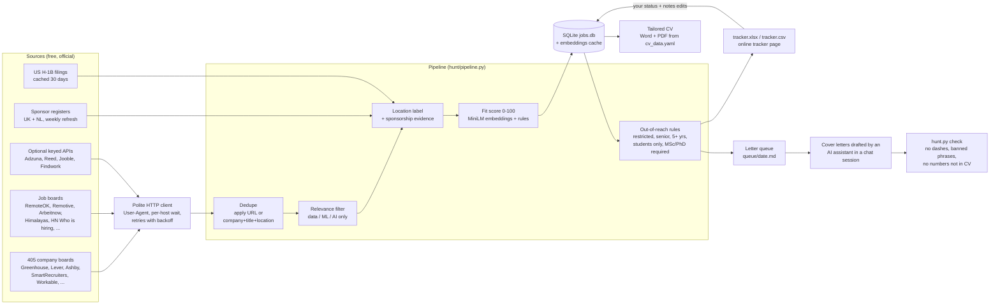

# Search (Job Hunt): System Design

Repo: https://github.com/MelvTheGoat/Search (private)

## The problem, in 3 lines

Finding ML and AI jobs you can actually get, from Nigeria, means checking hundreds of company career pages and job boards, then working out which ones will sponsor a visa or hire remotely.
This tool fetches jobs from free, official sources, removes duplicates, labels each one by whether it's in reach (remote-open, Nigeria, Africa, visa sponsor and so on), and scores each 0–100 against your CV, all on your own computer.
It keeps everything in a tracker and prepares a queue for cover letters. It never applies for you.

## Diagram

## Each part, and why it's there

| Part | Code | What it does | Why it's there |
|---|---|---|---|
| HTTP client | `hunt/http.py` | Clear User-Agent, a minimum wait between calls to the same host, retries with growing waits, timeouts. A site that still answers 429 after every retry, twice, is skipped for the rest of the run. | Being polite keeps you from being blocked, and some sources ask for it. |
| ATS sources | `hunt/sources/ats.py` | Reads company job boards on 9 applicant tracking systems (ATS), from the 405 boards listed in `config/companies.yaml`. | Company boards are the original, most complete job posts. |
| Board sources | `hunt/sources/boards.py` | Remote boards, aggregators, Amazon's search for African countries, and the HN "Who is hiring?" thread. Keyed APIs only run if a free key is set. | Wider coverage. LinkedIn and Indeed aren't used because they don't allow scraping. |
| Startup sources | `hunt/sources/startups.py`, `config/startups.yaml` | Reads the Y Combinator job board (which states each job's visa rule and minimum years). Weekly, rebuilds a list of ~295 startups and their Greenhouse/Ashby/Lever/Workable boards from the a16z jobs board, the Breakout List, Next Play and Ramp's vendor directory. Jobs get a `startup` tag. | Startups hire juniors and are missing from the big lists. The weekly rebuild keeps the list fresh without hand edits. |
| Source cache | `hunt/sources/__init__.py` | Caches aggregator results for some hours. | Remotive asks for no more than four calls a day. |
| Company check | `hunt/verify.py` | Tests every board. Tries other ATSs for dead tokens, and moves dead boards to `companies_removed.yaml`. | Company boards move or die. This keeps the list clean. |
| Dedupe | `hunt/dedupe.py` | Same apply URL, or the same company + title + location hash, counts as one job. The longer description wins. | The same job appears on many boards. ATS copies beat short snippets. |
| Relevance filter | `hunt/scoring.py` `is_relevant` | Drops titles that clearly aren't data/ML/AI. For generic "engineer" titles, needs enough ML words in the description. | Cuts noise before the slow scoring step. |
| Labeller | `hunt/labels.py`, `countries.py` | Gives a location label: `remote_open`, `nigeria`, `africa`, `sponsor_yes`, `sponsor_likely`, `sponsor_unknown`, `restricted`. Saves the exact restricting sentence as evidence. | Work rights decide whether a job is real for you. ECOWAS countries need no visa for Nigerians. |
| Sponsor registers | `hunt/registers.py` | Downloads the UK licensed sponsor list and the Netherlands IND list, refreshed weekly. | A company on these lists likely sponsors, even if the post doesn't say. |
| H-1B history | `hunt/h1b.py` | Looks up US H-1B filings (h1bdata.info): at least 5 filings with one in the last 3 years counts as a sponsor. Cached 30 days. | The same signal for US companies. |
| Scorer | `hunt/scoring.py` | Fit = weighted average of CV similarity, best-project similarity, skills overlap, role and domain, times a level multiplier, × 100. Also writes a `why`, the `gaps` and the top projects. | Ranks hundreds of jobs so you read the best first. No AI calls, all local. |
| Embedder | `hunt/scoring.py` `Embedder` | `all-MiniLM-L6-v2` on CPU, cached in SQLite. Falls back to a word-hash vector if the model can't load. | Fast, free semantic matching. The cache makes re-runs fast. |
| Reach rules | `hunt/reach.py` | Hides jobs that are restricted, abroad with no sponsor sign, senior or 5+ years, students-only, or requiring a Master's/PhD. | Keeps them in the DB (so they don't come back as "new") but out of your list. |
| Database | `hunt/db.py` | SQLite `jobs.db`. Upsert never overwrites your fields: status, notes, date applied, letter file, date found. | Re-runs must never lose your own tracking. |
| Export | `hunt/export.py` | Writes `tracker.xlsx` and `tracker.csv`. Reads your spreadsheet edits back first. | You can edit in Excel and nothing gets lost. |
| Tracker page | `hunt/page.py`, `docs/tracker-page.html` | `page-export` writes the files for an online page. `page-import` brings back status and note changes. Also a Startups tab (up to 150 extra startup jobs) and an Outreach section: contacts, statuses, follow-ups, message templates and cold-email buttons. | Check and update jobs from a phone. |
| Letter queue | `hunt/queue.py` | Writes `queue/<date>.md` with the top N jobs in reach. | The hand-off to letter writing. |
| Letter checker | `hunt/checker.py` | Flags dash characters, banned phrases, any number not found in your CV or projects, wrong length (default 150–250 words) and a missing sign-off. | Stops made-up numbers and filler in letters. |
| Tailored CVs | `hunt/cv.py` | Builds a Word file and PDF per job from `profile/cv_data.yaml`: same facts, with the headline, summary, project order and skill order picked for the job. One column, standard headings. | Tailoring without inventing, and readable by applicant tracking systems. |
| CLI | `hunt/cli.py`, `hunt.py` | `run`, `list`, `show`, `queue`, `check`, `mark`, `note`, `stats`, `rescore`, `verify-companies`, `startups`, `page-export`, `page-import`, `cv`. `list --startups` shows only startup jobs. | One command per daily step. |

**What's outside the code:** the cover letters themselves are written by an AI assistant in a chat session, following rules in the repo, not by the Python code. The Python code prepares the queue and then **checks** what was written.

## Tech stack

| Tool | What it's used for | Why this one |
|---|---|---|
| Python 3.10+ | Everything | Simple scripting and data work |
| requests | HTTP | Simple, reliable |
| sentence-transformers (all-MiniLM-L6-v2) | Embeddings for CV–job match | Small (~90 MB), runs on CPU, free |
| numpy | Vector maths | Cosine similarity |
| SQLite | Jobs DB + embedding cache | One file, no server |
| openpyxl | Excel tracker | Two-way sync with your edits |
| python-docx | Tailored CVs | Word output (PDF too) |
| PyYAML | All settings | Weights, patterns and lists editable without code |
| python-dotenv | Optional API keys | Keys stay out of git |
| pytest | Tests | Offline tests with sample data |
| cron / Task Scheduler | Daily run | Free, built in |

## Data flow, step by step

1. `python hunt.py run` loads settings and creates the polite HTTP client.
2. Fetch all enabled company boards and job boards. **One broken source never stops the run.** Errors are collected and shown.
3. Dedupe by apply URL or company/title/location, keeping the longer description.
4. Drop jobs that aren't about data, ML or AI.
5. Embed all job texts in one batch (cached).
6. For each job: label the location and sponsorship (post text, sponsor registers, H-1B history), score the fit, and upsert into `jobs.db` without touching your fields.
7. Read your edits from `tracker.xlsx`, then write a fresh `tracker.xlsx` and `tracker.csv`. Jobs out of reach are left out.
8. `python hunt.py queue --top 15` writes the letter queue.
9. An AI assistant drafts letters into `output/letters/`. `python hunt.py check` flags problems. `mark-drafted` links letters to jobs.
10. You read each letter, apply yourself, and record it with `mark` and `note`.

## Trade-offs and limits

- **The fit score is a heuristic, not a trained model.** Weights (0.30/0.20/0.20/0.22/0.08) and level multipliers are hand-set in `config/scoring.yaml`. **How well the score predicts interviews is not measured in the repo yet.**
- **Regex rules for level, sponsorship and reach** will miss some wording, and some jobs will be mislabelled. The labeller keeps the exact sentence as evidence, so you can check.
- **Sponsor signals are indirect.** Being on a register or having H-1B history doesn't mean a given role sponsors.
- **Embedding similarity is shallow.** MiniLM on 180-word chunks (max 4) catches topic overlap, not seniority or depth.
- **Letters depend on a person (plus an AI assistant) in the loop.** The checker only catches mechanical issues (numbers, dashes, phrases, length), not tone or accuracy of claims beyond numbers.
- **Scraping depends on third-party APIs** that change. `verify-companies` helps, but sources can break.
- **Personal data in the repo.** The repo holds CV data, letters and tailored CVs, so it must stay private.

## What I'd change at 10x scale

For 10x more sources, or turning it into a service for many users:
- **Fetch in parallel** with async HTTP and per-host rate limits.
- **Postgres instead of SQLite**, with one user table and per-user CVs.
- **A vector index** (pgvector or FAISS) for job embeddings, instead of scoring every job against the CV in a Python loop.
- **Learn the weights** from outcomes (applied → interview → offer) instead of hand-setting them, once there's enough data.
- **A job queue** (e.g. Celery or RQ) for fetching, scoring and CV generation.
- **Privacy controls:** encrypt CVs and letters at rest, and give each user their own data.
- **Replace regex labels** with a small classifier for sponsorship and seniority, trained on labelled sentences.
