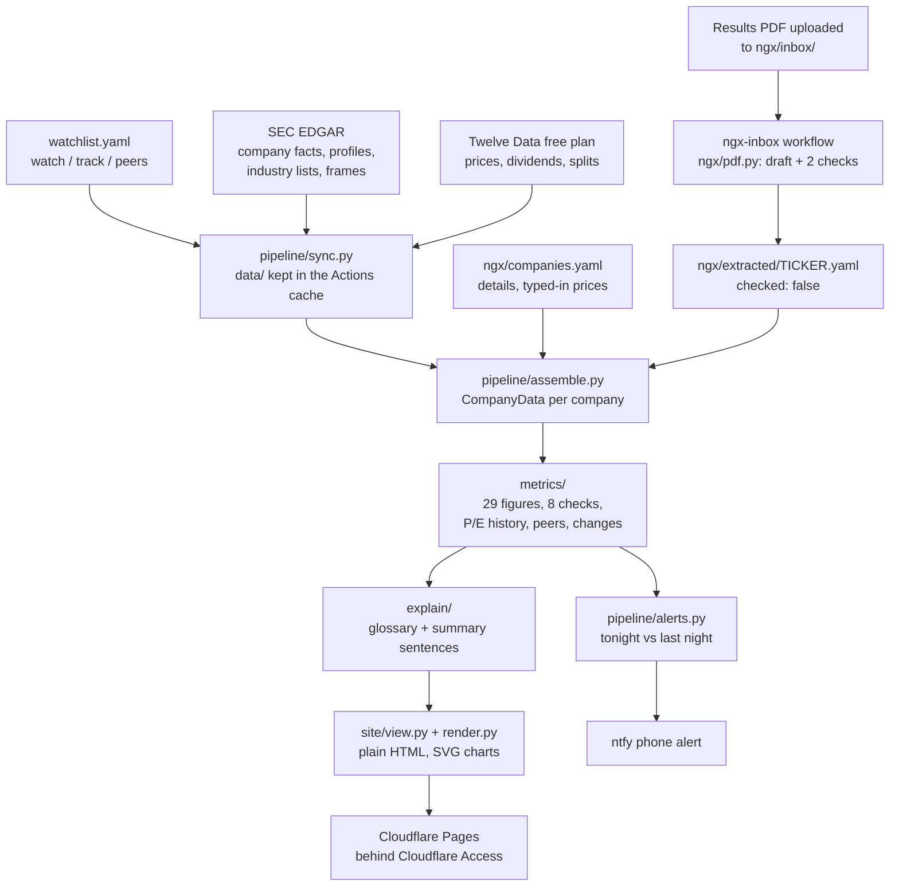

# Stocks: System Design

Repo: https://github.com/MelvTheGoat/Stocks

> **Status:** a working research website, rebuilt every weekday night. The repo started on 18 Sep 2026 as an eval-first AI agent for stock questions. On 6 Oct 2026 the agent, eval harness and Kaggle runner were removed, the package was renamed `research`, and it became this tool (merged to `main` on 8 Oct). The data layer from the earlier project was kept.

## The problem, in 3 lines

A price chart can't tell you whether a company makes money, burns cash or can pay its debts.
This tool builds a private page for each company, US or Nigerian, with sourced figures, hand-written explanations and eight warning checks.
It never advises buying or selling: it lays out the inputs to that decision so the reader learns to make it.

## Diagram

## Each part, and why it's there

| Part | Code | What it does | Why it's there |
|---|---|---|---|
| Figure type | `company.py` | `Figure` = value, unit, currency, as-of date, sources, a `missing` sentence, notes, stale flag. `CompanyData` holds everything for one company. | Every number on a page can say where it came from, or why it isn't there. A test checks every figure has one or the other. |
| Watchlist | `pipeline/watchlist.py`, `watchlist.yaml` | `watch` (home page + alerts), `track` (built, searchable, usable as peers), optional hand-picked `peers`. Mistakes are reported by name. | A company silently dropping off the list is worse than a build that stops. |
| SEC client | `fundamentals/sec_client.py` | Sends a contact email in the User-Agent and stays under 10 requests a second. | The SEC returns 403 without the email. |
| SEC parsing | `fundamentals/sec.py`, `concepts.py` | One value per figure per period from 10-K/10-Q filings; the latest filing wins (picks up restatements). Each figure maps to several SEC labels, chosen per period. | Companies change labels: Apple's revenue label changed in 2018. |
| Periods | `fundamentals/financials.py` | Last twelve months = last full year + this year so far − same part of last year. Q4 = full year − nine months. Debt built from its parts on one balance-sheet date. | Filings don't give the periods readers want, and nobody reports Q4 on its own. |
| Prices | `data/sources/twelvedata*.py`, `data/store.py` | Free plan: 800 requests a day, 8 a minute. Fetches only new days, under a 700-request budget; dividends and splits weekly. Stored as Parquet, read with DuckDB, merge-on-key writes. | Free, and re-running never duplicates data. Three API traps are guarded (see below). |
| Sync | `pipeline/sync.py` | SEC accounts fetched nightly; ticker list, industry listings and frames weekly or monthly; prices incrementally. Never stores today's unfinished price bar. | Each source has a different budget. |
| Peer search | `pipeline/peer_search.py` | The SEC's company list for the industry (SIC) code, cut to companies on a major exchange, ranked by closeness in revenue using the SEC frames file. | Of 100 companies filed under 3571 (computer makers), only six still trade. |
| Figures | `metrics/core.py` | 29 figures: price, market cap, P/E, price-to-book, dividend yield, growth, margins, return on equity, cash flow, debt, interest cover, cash runway, share change, trading activity, price moves. | One function per figure, each tested. |
| Warning checks | `metrics/checks.py` | Eight checks (price fall, sales trend, profitability, cash burn, debt payments, new shares, ease of selling, value against peers), each with its rule written out. | Tells "cheap and overlooked" from "cheap and failing". The reader can disagree with the rule. |
| P/E history | `metrics/history.py` | P/E at each quarter end over five years, the middle half of that range, and where today's sits. | "Is 30 times profit expensive?" only has an answer against something. |
| Peers | `metrics/peers.py` | Picks peers by industry code, widening from four digits to three to two (and saying which), and compares with their middle values. | Context against similar companies. |
| Latest report | `metrics/changes.py` | Latest quarter against the same quarter a year earlier: sales, profit, cash, debt, shares. | The questions everyone asks when a report comes out. |
| Explanations | `explain/glossary.py`, `explain/summary.py` | Hand-written "what it is / what to compare it with / how it misleads" for every figure. Summary sentences built from the company's own figures. | Fixed text can be checked; generated text can't. Tests ban advice words. |
| Nigerian companies | `ngx/manual.py`, `ngx/pdf.py`, `scripts/read_ngx_inbox.py` | Reads hand-entered figures (each needs a source and page). The PDF reader finds the three statements, picks the year-to-date column by matching profit before tax with the cash flow statement, checks the balance sheet balances, writes a draft marked `checked: false`, then deletes the PDF. | NGX's terms forbid automated collection, so a person fetches the PDF and the tool only reads it. |
| Website | `site/view.py`, `render.py`, `charts.py`, templates | Plain HTML from Jinja templates, light and dark themes, SVG charts drawn at build time with a table beneath, one small script. Tier 1 sentences show; tier 2 detail opens with `
`. | Static files cost nothing to host and work without the script. |
| Alerts | `pipeline/alerts.py` | Compares tonight's snapshot of watched companies with last night's. One ntfy message if anything changed. | You hear about a new report or a failed check without checking the site. |
| Nightly job | `scripts/build.py`, `.github/workflows/nightly.yml` | 01:17 UTC, Tuesday to Saturday. Restore cache, fetch, build, save cache, then publish only if `SITE_IS_PRIVATE` is `yes`. | The licence on US prices is personal use, so publishing waits until the login is in place. |
| Test fixtures | `.github/workflows/sec-samples.yml`, `scripts/fetch_sec_samples.py`, `scripts/trim_sec_fixtures.py` | Fetches real SEC samples on a GitHub runner, pushes them to a `sec-samples` branch, and trims them to the labels the tool reads. | The SEC refuses requests from the development machine. |

## Tech stack

| Tool | What it's used for | Why this one |
|---|---|---|
| Python 3.11+ | Everything | Standard for data work |
| httpx | SEC and Twelve Data requests | Timeouts, and easy stand-ins in tests |
| Parquet + DuckDB (pyarrow) | Price store | Plain files, real SQL, no server |
| Jinja2 | HTML templates | Simple, static output |
| pypdf | Reading results PDFs | Pure Python, reads text PDFs |
| PyYAML | Watchlist and Nigerian data | Easy to edit on GitHub |
| pytest, pytest-socket, ruff | Tests and lint | 436 tests pass (1 skipped); CI repeats them with sockets disabled |
| GitHub Actions | Nightly build, PDF inbox, SEC samples, tests | Free; the Actions cache holds the data between runs |
| Cloudflare Pages + Access | Hosting behind an email one-time-PIN login | Free for up to 50 users |
| ntfy | Phone alerts | Free, no account |

## Data flow, step by step

1. **01:17 UTC, Tuesday to Saturday**, the nightly workflow starts and restores `data/` from the Actions cache.
2. **Read the watchlist.** Any typo stops the build with a named error.
3. **Sync.** SEC company facts for every company (free, 10 a second). Twelve Data prices only for days not held yet, stopping at 700 requests; the next night carries on. Dividends and splits weekly.
4. **Peer search** for watched US companies, using the SEC industry listing and frames.
5. **Assemble** a `CompanyData` for each company, including Nigerian ones from `ngx/companies.yaml` and `ngx/extracted/`.
6. **Work out** 29 figures, 8 checks, the P/E history, peer comparison and latest-report changes. Mark stale figures (price over 4 days, accounts over 140 days).
7. **Explain:** attach glossary text and build the summary sentences.
8. **Render** plain HTML pages: home (watchlist), one per company, compare (up to four), and data freshness.
9. **Save** the cache, check the site, and **publish** to Cloudflare Pages only if the login is in place.
10. **Alert:** compare with last night and send one ntfy message if something changed for a watched company.

Separately, uploading a PDF to `ngx/inbox/` starts the `ngx-inbox` workflow, which drafts the figures, deletes the PDF and commits the draft. That push triggers a rebuild.

## Trade-offs and limits

- **Nigerian prices are typed in by hand.** NGX's terms forbid automated collection without written consent, and its licensed feed costs money (end-of-day prices are N125,000 a year). A draft email to NGX asks about personal-use access. Paid options are listed in `DATA_SOURCES.md` for the owner to decide.
- **No Nigerian company entered yet.** `ngx/companies.yaml` is empty and both `ngx` lists in the watchlist are empty.
- **PDF reading tested on one real report** (NGX Group Q1 2026, both checks passed). Scanned PDFs have no text and must be typed in.
- **Personal-use licence.** The US price data is licensed for personal use, so the site must stay behind a login and the repo should be private.
- **Free-plan speed.** The first run fetches years of prices at 8 a minute and can take up to an hour.
- **Live status unknown.** `DEPLOY.md` lists the setup steps (secrets, Cloudflare, the `SITE_IS_PRIVATE` switch); the repo doesn't show whether they've been done.
- **Leftovers.** `calendar.py` and `crosscheck.py` are tested but not used by the site, and an Alpha Vantage parser remains from the earlier project.

## What I'd change at 10x scale

At 10x the companies or users:
- **A paid price feed** (Twelve Data paid, or EODHD for both markets). The free 800 a day would not cover thousands of companies.
- **A licensed NGX feed**, so Nigerian prices aren't typed in.
- **Real storage** instead of the Actions cache, such as object storage, so a lost cache doesn't mean a re-fetch.
- **Per-user logins and watchlists** if it were shared, plus the licences that sharing would need.
- **OCR** for scanned Nigerian PDFs, still with a person checking.
- **Incremental builds:** only rebuild pages whose data changed.
