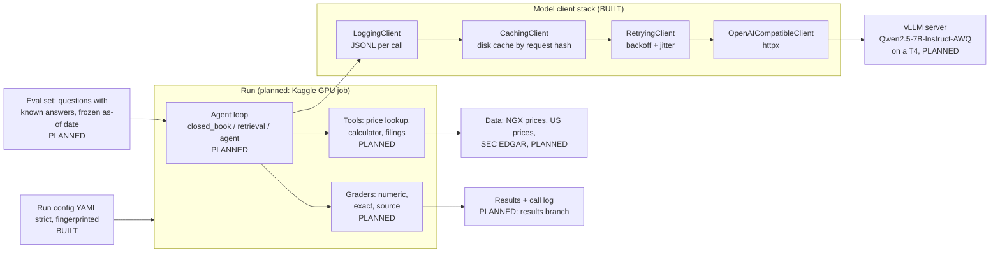

# Stocks: System Design

Repo: https://github.com/MelvTheGoat/Stocks

> **Status: early.** What exists today is the run config, the model-calling plumbing, the tests and CI. The agent, the question set (eval), the data pipeline and the Kaggle runner are **planned but not built yet**. This document marks every part as **Built** or **Planned**.

## The problem, in 3 lines

Language models can sound confident and still make up a share price.
This project will build an agent that answers factual questions about US stocks and Nigerian (NGX) stocks, and, more importantly, the evaluation that measures how often it's right.
The Nigerian side matters because models know a lot about Apple and very little about Nigerian Breweries, so it shows how much of a model's skill is memory rather than reasoning.

## Diagram

## Each part, and why it's there

| Part | Status | What it does | Why it's there |
|---|---|---|---|
| Run config (`config.py`) | Built | One YAML file defines a whole run: model, sampling, eval split, agent type, seed. Pydantic models with `extra="forbid"` reject unknown keys. `fingerprint()` gives a 12-character hash of the config. | A typo like `temparature` would otherwise be silently ignored and every result mislabelled. The fingerprint lets you tell if two results came from the same setup. |
| `ModelClient` interface (`llm/base.py`) | Built | One `chat(request) -> response` shape for every model call. Two error types: `TransientModelError` (retry) and `PermanentModelError` (don't). | Tests use a fake, the GPU box uses a real one, and the code in between can't tell the difference. |
| `ChatRequest.cache_key()` | Built | SHA-256 of the entire request, built from `dataclasses.asdict`. | A new field added later is automatically part of the key, so the cache can never serve an answer made with different settings. |
| `OpenAICompatibleClient` | Built | Posts to `/v1/chat/completions` with httpx. Timeouts, connection errors, 429 and 5xx → transient. Other 4xx or a malformed body → permanent. `is_ready()` polls `/models`. | vLLM speaks this format, so the same client works on Kaggle and elsewhere. |
| `RetryingClient` | Built | Exponential backoff with jitter (1 s base, 30 s cap, 4 retries). Only retries transient errors. | Retrying a bad request wastes scarce GPU time. Not retrying a 503 throws away a run. |
| `CachingClient` + `ResponseCache` | Built | One JSON file per request, sharded into 256 folders. Write-then-rename so a killed session can't leave half a file. | About 30 GPU hours a week (per the code comments). Re-grading shouldn't cost a single model call. |
| `LoggingClient` + `CallLog` | Built | Appends one JSON line per call: tokens, latency, cached or not, errors. | Cost and latency are results too. Logging sits above the cache, so cache hits are still counted. |
| `build_client()` | Built | Stacks them: logging → cache → retries → HTTP. | Order matters. A call that fails twice then succeeds is cached once and logged once. |
| `FakeModelClient`, `NeverCalledClient` | Built | Scripted replies for tests, and a client that fails the test if it's called at all. | Lets tests prove that a path does **not** reach the model. |
| CI: tests (`tests.yml`) | Built | Ruff lint, pytest, then pytest again with sockets disabled. | A test that quietly starts using the network fails here, not on the day the service is down. |
| CI: authorship (`authorship.yml`) | Built | Fails if any file or commit message contains AI-tool attribution strings. | Keeps the repo's authorship clean as a rule, not a habit. |
| `DATA_SOURCES.md` | Built (research) | Records every data source checked, with dates and terms. | "Nothing gets collected until it has an entry here." |
| NGX collector (`collectors/`) | Planned | The folder exists but is empty. | `ngxgroup.com` is behind a bot filter (Sucuri WAF), so it isn't used. `african-markets.com` is a candidate, but its terms are unconfirmed. |
| US data | Planned | SEC EDGAR plus a free price source. | Not investigated yet. |
| Eval set and graders | Planned | Questions with known answers, frozen to an as-of date. Graders: numeric, exact, source. | The core idea: build the measuring stick before the agent. |
| Agent | Planned | Three kinds in the config: `closed_book`, `retrieval`, `agent` (with tools and an optional self-check pass). | The first two are baselines. The third is the real system. |
| Kaggle runner | Planned | Would run vLLM on a free T4 GPU and read jobs from a queue. | Free GPU. The README lists this as "not started". |

## Tech stack

| Tool | What it's used for | Why this one |
|---|---|---|
| Python 3.10+ | Everything | Standard for LLM tooling |
| Pydantic v2 | Strict run config | Validation with clear errors. `extra="forbid"` catches typos. |
| PyYAML | Config files | Human-readable run definitions |
| httpx | HTTP client | Timeouts, and a pluggable transport so tests never open a socket |
| pytest, pytest-socket | Tests | 64 tests pass in about 1.5 s. The second CI pass blocks the network. |
| ruff | Lint | Fast. Rules E, F, I, UP, B. |
| vLLM (planned) | Serving the model | Fast open-model serving with an OpenAI-compatible API |
| Qwen2.5-7B-Instruct-AWQ (planned candidate) | The model | 4-bit weights (~5 GB) fit a 16 GB T4 with room for the KV cache. The config says the final pick is "settled in Phase 5". |
| Kaggle (planned) | Free GPU | T4, no cost |
| GitHub Actions | CI | Free |

## Data flow, step by step (as designed)

1. **Pick a config**, e.g. `configs/smoke.yaml`. It's loaded and validated, and its fingerprint is taken. *(Built)*
2. **Load the eval questions** for the chosen split and version, frozen at `as_of`. *(Planned)*
3. **For each question, the agent builds messages.** `request_from_config()` fills in sampling settings from the config only. *(Built helper, planned agent)*
4. **The call goes through the stack:** log → cache (hit: return saved answer) → retry → HTTP → vLLM. *(Built, except vLLM)*
5. **In agent mode, the model may call tools** (price lookup, calculator) up to `max_steps`, with an optional self-check pass. *(Planned)*
6. **Grade the answer:** numeric tolerance, exact match, and whether the cited source is right. *(Planned)*
7. **Write results and the call log**, labelled with the config fingerprint, to a results branch. *(Planned)*

The smoke config's own description says it's "not a measurement of anything". It only proves the pipe works end to end.

## Trade-offs and limits

- **Eval-first means slow visible progress.** There's no agent yet, so there's nothing to demo. That's a deliberate choice, but it's also the main limit today.
- **No results exist.** The README says "not run yet" instead of placeholder numbers. Accuracy, latency and cost are **not measured in the repo yet**.
- **Data access is the real blocker.** The official NGX site blocks automated access, and the second-hand source has no terms page. The project refuses to work around the bot filter.
- **Free GPU budget** (about 30 hours a week on Kaggle, per the code comments) shapes everything: caching, retries and a small quantised model.
- **One model is planned.** Only one candidate is named in the config so far.
- **Earlier prototype removed.** An earlier Next.js version (a question-answering page over a small text corpus, with guardrails and naira formatting) was deleted on 27 Sep to start again in Python. None of it is in the current code.

## What I'd change at 10x scale

At 10x the questions, models or users:
- **Move serving off Kaggle** to a paid GPU host or a hosted inference API. Kaggle sessions have time limits and aren't a service.
- **Batch requests.** vLLM is much faster with many requests at once. The current client sends one at a time.
- **Replace the file cache** with a key-value store (e.g. Redis or S3 plus an index). One JSON file per call gets slow at millions of entries.
- **Ship the call log to a real store** (e.g. a warehouse table) for cost dashboards.
- **Version the eval set** in a dataset registry, with a strict dev/test split so the test set is never tuned on.
- **Licensed market data.** At scale, scraping or second-hand data isn't acceptable. A proper data licence would be needed.
