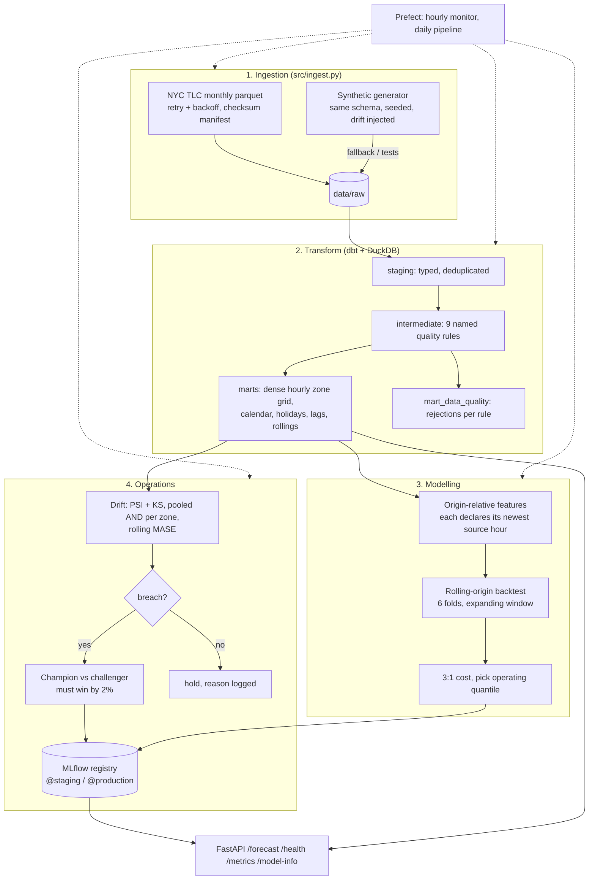

# nyc-taxi-demand-forecast: System Design

Repo: https://github.com/MelvTheGoat/nyc-taxi-demand-forecast

> **All headline numbers come from synthetic data.** The NYC TLC download endpoint was blocked in the build environment, so the ingestion path falls back to a seeded generator with the same schema. The README's results table isn't committed (`reports/` is generated), but a smaller CI baseline is (`baselines/backtest_baseline.json`).

## The problem, in 3 lines

A taxi dispatcher has to decide, every hour and in every zone, how many drivers to position, and the forecast drives that decision.
Under-forecasting (riders wait and give up) is priced at **3×** over-forecasting (a driver idles), so the right forecast isn't the average: it's the **75th percentile**.
This system forecasts hourly pickups per zone 24 hours ahead, backtests itself without leakage, watches for drift, retrains only when a challenger is clearly better, and serves forecasts over an API. It runs from one command.

## Diagram

## Each part, and why it's there

| Part | Code | What it does | Why it's there |
|---|---|---|---|
| Synthetic generator | `src/synthetic.py`, `scripts/make_synthetic.py` | TLC-schema trips with seasonality, holidays, dirty rows, and a demand redistribution drift (half the zones up ~38%, half down ~26%). | Real data was unreachable, and tests need no network. |
| Ingestion | `src/ingest.py` | Idempotent monthly downloads, retry with backoff, checksum manifest (skip if unchanged), null profiling. Falls back to synthetic. | Safe to re-run on a schedule. |
| dbt + DuckDB | `dbt_project/` | Staging → intermediate (9 named cleaning rules) → marts (dense hour × zone grid, calendar, holiday seed, lags, rollings) + a data-quality mart. Custom tests: no gaps in the hourly grid, lag alignment, demand equals cleaned trips. | SQL transforms that are tested and documented. |
| Features | `src/features.py` | Features defined relative to the **forecast origin** (`OriginLag`, `OriginRolling`, `TargetLag` only if `k ≥ horizon`, `CalendarFeature`). Each declares its newest source hour, and the builder refuses leaks. | `lag_1h` is leakage for a 24h forecast. |
| Models | `src/models.py` | Seasonal naive, hour-of-week mean, `SeasonalProfileZone` (per-zone weekly profile × last-168h level ratio), LightGBM quantile family (q10–q90), and a cost-weighted LightGBM. | Strong baselines plus a quantile model. |
| Cost | `src/cost.py` | `3·under + 1·over`, a cost curve across quantiles, and picks the operating quantile empirically. | Newsvendor theory says τ* = 0.75, but check it on data. |
| Backtest | `src/backtest.py` | Rolling origin, expanding window, 6 folds. A training row is admitted only if its **target** hour precedes the first test origin. | Honest, time-respecting evaluation. |
| Tracking | `src/tracking.py` | MLflow runs plus an alias-based registry (`@staging`, `@production`). | Traceable models and promotion. |
| Monitoring | `src/monitoring.py` | PSI + KS on demand-derived features, **pooled and per zone**, plus rolling MASE. Calendar features excluded. | Pooled drift missed the redistribution. |
| Retraining | `src/retrain.py` | Champion vs challenger on the same backtest. The challenger must beat the champion by **2%**. | No promotion on noise. |
| Regression gate | `src/regression_gate.py`, `scripts/ci_regression_check.py`, `baselines/` | CI compares backtest metrics with a committed baseline (10% tolerance). | Catches accidental regressions. |
| Orchestration | `src/flows.py` | Prefect flows: hourly monitor, daily pipeline. | Self-operating. |
| Serving | `src/serve.py` | FastAPI: `/forecast` (operating value + quantiles), `/health`, `/metrics`, `/model-info`. | The decision input for dispatch. |

## Tech stack

| Tool | What it's used for | Why this one |
|---|---|---|
| Python, pandas, numpy, scipy | Core | Standard |
| DuckDB | Local warehouse | Fast, in-process, no server |
| dbt (dbt-duckdb) | SQL transforms + tests | Documented, tested models |
| LightGBM | Quantile regression | Fast, native quantile objective |
| MLflow | Tracking + registry | Aliases for champion/challenger |
| Prefect 3 | Scheduling | Python-native flows |
| Evidently | Drift report support in `monitoring.py` | Standard drift tooling alongside the PSI/KS code |
| FastAPI | Serving | Simple |
| tenacity, requests | Reliable downloads | Retry with backoff |
| Docker Compose, Makefile, GitHub Actions | Ops | One-command runs, CI |
| pytest, ruff, mypy | Quality | 167 tests pass (my run) |

## Data flow, step by step

1. **Ingest** TLC months (or synthetic) with a checksum manifest.
2. **dbt build:** clean with 9 named rules, build a dense hour × zone grid with calendar/holiday/lag features, and run the dbt tests.
3. **Features** relative to each forecast origin, with the leakage contract enforced.
4. **Backtest** 6 rolling-origin folds × 24h horizon. Fit baselines, the profile model and the LightGBM quantile family.
5. **Cost:** evaluate total 3:1 cost at each quantile and pick the operating quantile (q80 for LightGBM on the headline run).
6. **Register** the model in MLflow. Bootstrap `@production`.
7. **Monitor** hourly: pooled and per-zone PSI/KS on demand features, and rolling MASE.
8. **If there's a breach:** train a challenger and duel. Promote only on a ≥2% improvement, otherwise hold and log the reason.
9. **Serve** `/forecast` with the operating quantile plus q10/q50/q75/q90.

## Trade-offs and limits

**Headline results (README, synthetic, 6 folds × 7 days, 8 zones, ~32k zone-hours):**

| Model | MASE | Total cost | vs seasonal naive |
|---|---|---|---|
| LightGBM global (q0.80) | 0.825 | **104,568** | −32.1% |
| Seasonal profile per zone | **0.818** | 104,782 | −32.0% |
| Cost-weighted LightGBM | 0.938 | 108,648 | −29.5% |
| Hour-of-week mean | 0.863 | 113,594 | −26.2% |
| Seasonal naive | 1.042 | 154,010 | — |

- **The operating point matters as much as the model:** shipping q50 instead of q80 costs +25%.
- **The simple per-zone profile ties LightGBM** (within fold noise). LightGBM ships for its quantile family, not for accuracy.

**Limits:**
- **Synthetic only.** Real TLC data was never downloaded, and real demand has weather, events and fatter tails.
- **Small counts per zone-hour** (mostly single digits), so a low accuracy ceiling.
- **No weather or events.**
- **The 3:1 cost ratio is assumed.**
- **Marginal quantiles**, not joint (you can't sum q90 across hours).
- **No shadow period** before promotion.
- **Zones modelled independently.**
- **No data versioning** (DVC).
- **Single-node** (DuckDB, one API replica).
- **Stray file:** `Startup_Analysis.ipynb` (from the separate Startup-analysis repo) sits in the root, left over from the June commits.

## What I'd change at 10x scale

- **Real data at city scale** (all ~260 zones, multiple taxi types) → a warehouse like BigQuery/Snowflake with dbt, or Spark for ingestion.
- **Weather and event features** from external APIs.
- **Hierarchical/cross-zone models** (neighbouring zones share demand shifts).
- **Shadow deployment** and gradual rollout for challengers.
- **Data versioning** (DVC or lakehouse time travel) so any model can be rebuilt.
- **Multiple API replicas** with shared metrics (Prometheus) and a cache of precomputed forecasts.
- **An estimated cost ratio** from rider-abandonment and driver-idle data.
