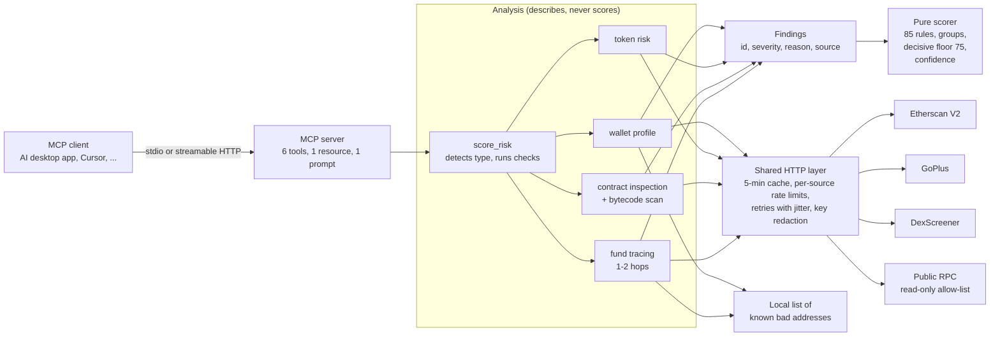

# web3-risk-mcp: System Design

Repo: https://github.com/MelvTheGoat/web3-risk-mcp

## The problem, in 3 lines

Crypto scams (honeypot tokens, rug pulls, hidden owner powers, stolen funds) are fast and final. There's no bank to call.
People now ask AI assistants "is this token safe?", and without real data the assistant can only guess.
This project is an **MCP server**: a read-only tool pack that any MCP-compatible AI assistant can call to check a wallet, token or contract, and get a 0–100 risk score with a reason for every point.

## Diagram

## Each part, and why it's there

| Part | Code | What it does | Why it's there |
|---|---|---|---|
| MCP server | `server.py` | Registers 6 tools (`score_risk`, `get_wallet_profile`, `check_token_risk`, `inspect_contract`, `trace_funds`, `list_supported_chains`), the `risk://scoring-method` resource and the `investigate_address` prompt. Every tool is marked `readOnlyHint`. | Write tools once, and every MCP client can use them. |
| CLI | `__main__.py` | Runs over stdio (local clients) or streamable HTTP at `/mcp`. | Local apps use stdio. Remote or Docker use HTTP. |
| Config | `config.py` | Settings from `.env` via pydantic-settings. | Keys stay out of code. |
| Chains | `chains.py` | Ethereum, Base, Arbitrum One, Polygon PoS, BNB Chain and Arc (chain 5042, added Oct 2026), plus address checks. | One place for chain IDs and validation. |
| HTTP layer | `clients/http.py` | Cache (5 minutes by default), a rate limit per source under free-plan limits, retries on timeout/429/5xx with exponential backoff and jitter, and API keys stripped from logs, cache keys and errors. | Free APIs are slow and limited. Keys must never leak. |
| Etherscan client | `clients/etherscan.py` | V2 API: history, source code. One key covers all chains. | Wallet history and verified source. |
| GoPlus client | `clients/goplus.py` | Token and address security flags. | Broad scam coverage (honeypot, taxes, labels). |
| DexScreener client | `clients/dexscreener.py` | Pools and liquidity. | Liquidity size and pool data. |
| RPC client | `clients/rpc.py` | Balance, code and proxy slots. **Refuses any method outside a read-only allow-list.** | A second safety net: no code path can send a transaction. |
| Wallet analysis | `analysis/wallet.py` | Age, balance, sent count, top counterparties, recent tokens, activity patterns, first funder, labels. | Behaviour signals for wallets. |
| Token analysis | `analysis/token.py` | Honeypot signs, mint/blacklist/pause powers, buy and sell tax, holder concentration, liquidity and locks. | Most retail scams are token scams. |
| Contract analysis | `analysis/contract.py`, `selectors.py` | Verified or not, upgradeable proxy, who controls it (single wallet, multisig, nobody). Scans bytecode for known 4-byte function selectors when unverified. Plain-English summary. | Hidden owner powers are the main risk in contracts. |
| Fund tracing | `analysis/trace.py` | Follows the busiest in/out flows for 1–2 hops (latest 100 txs at the root, 50 at hop 2, fan-out 3). Flags mixers, sanctioned wallets, exploiters and phishing, with the path. Skips expanding exchanges, protocols and burn addresses. | "Dirty money" checks. |
| Local labels | `labels.py`, `data/known_addresses.json` | A small, hand-checked list of known mixers and exploiters. | High-precision anchors. GoPlus gives the broad coverage. |
| Findings model | `models.py` | Stable ID, severity, reason, source. | Analysis only *describes*, which keeps scoring separate and testable. |
| Scorer | `scoring.py` | 85 rules (11 decisive, 4 trust signals with negative points). Same-problem findings share a group and only the biggest counts. Clamped to 0–100. Decisive findings set a floor of 75. Confidence comes from how many sources answered. | Fully explainable. Anyone can recompute it by hand. |
| Method doc | `method.py`, `scripts/render_method_doc.py`, `docs/risk-method.md` | Generates the rule table doc from code. A test fails if it drifts. | Docs can't go stale. |
| Prompt | `prompts.py` | A step-by-step plan: which tools to call and how to explain results to a beginner. | Guides the assistant to a consistent investigation. |
| Arc extras | `analysis/arc.py`, `clients/rpc.py` | Reads `isBlacklisted` on Arc's USDC and EURC contracts (80 points, decisive), simulates a 1 USDC payment with a read-only `eth_call` (`send_check`, doesn't change the score), reads USDC flows only from the EIP-7708 system Transfer stream so nothing is counted twice, and gives 13 official Circle/Arc contracts a −30 trust signal. | Arc's USDC is both the native coin (18 decimals) and an ERC-20 (6 decimals), and a payment to a blocked address fails but still costs the fee. |
| Arc Safe Send | `web/` (FastAPI + plain JS), `Dockerfile.web`, `render.yaml` | One `POST /api/check` call behind a page. Cache (10 min), per-visitor limits (6/min, 40/hour), a daily cap of 1,500. The user's own browser wallet pays or saves a check. Live on Render's free plan. | A checked payment for people, with the same read-only server. |
| RiskAttestation | `contracts/` (Solidity, Arc Foundry), `attestation.py` | A tiny contract with no owner and no funds that records address, score, rule version, findings hash, time and saver. Deployed on Arc mainnet. | A public, checkable record of a check. |
| Evaluation | `evaluation.py`, `eval/` | 34 hand-labelled addresses (12 risky, 22 safe). ROC AUC, precision, recall, false alarms and misses at threshold 50. Runs twice: with and without the local bad list. Record/replay "cassette". | An honest measure, including what works without the local list. |

## Tech stack

| Tool | What it's used for | Why this one |
|---|---|---|
| Python 3.11+ | Everything | Async and typing |
| `mcp` SDK (2.x) | MCP server, tools, resource, prompt | The official protocol SDK |
| httpx | Async HTTP | Timeouts, async, easy mocking |
| pydantic / pydantic-settings | Models and config | Typed results and settings |
| pycryptodome | Keccak hashing | Function selectors and storage slots |
| Etherscan V2, GoPlus, DexScreener, public RPC | Data | Free tiers |
| uv | Packaging and lock file | Fast, reproducible installs |
| pytest, pytest-asyncio, respx | Tests | All HTTP mocked, no keys needed. 170 tests pass (my run). |
| FastAPI, Solidity (Arc Foundry), Render | Arc Safe Send and RiskAttestation | Small web API, an on-chain record, free hosting |
| ruff | Lint and format | Fast |
| Docker | Deployment | Non-root image, HTTP or stdio |
| GitHub Actions | CI | Lint, format, tests on 3.11/3.12/3.13, Docker build |

## Data flow, step by step (`score_risk`)

1. The assistant calls `score_risk(address, chain)`.
2. Validate the chain and address format.
3. Read the address's code over RPC. No code means a wallet. Code means a contract or token.
4. Run the right checks in parallel: for code, token check + contract inspection + labels (then call it a token if token data came back). For a wallet, wallet profile + 1-hop trace. Each is wrapped, so one failing source doesn't stop the rest.
5. Each check returns **findings** (ID, severity, reason, source) and a **source status** (ok or failed, and why).
6. The scorer looks up each finding's rule, keeps only the biggest per group, sums, clamps to 0–100, applies the decisive floor of 75, and sets confidence from source success.
7. It returns: score, level (low/medium/high/critical), verdict, confidence, address type, every contribution (points, counted?, reason, source), checks run, and data gaps.

## Trade-offs and limits

- **Rule weights are hand-picked**, not learned. They follow known scam patterns.
- **Evaluation (30 Sep 2026, `eval/results.md`, replayable from `eval/fixtures/`):** ROC AUC 0.981, precision 0.917, recall 0.917: 1 false alarm in 22 safe addresses (USDT, 68) and 1 miss in 12 risky (the SQUID rug pull, 30). Without the local bad list: AUC 0.958, 3 of 12 missed. The rules were tuned after this first run (owner-power cap of 30, plain contracts no longer scored as tokens, EIP-7702 delegated wallets treated as wallets).
- **Small eval set** (34 items), with wide uncertainty, and no Arc addresses yet.
- **Sampled history:** latest 100 transactions (50 at hop 2), busiest paths only. Old or low-volume links can be missed.
- **Bytecode scanning is a heuristic.** Renamed or custom functions slip through.
- **A low score means "no red flags found", not "safe".** A brand-new scam unknown to GoPlus can score low.
- **Etherscan's free plan** lacks account history on Base and BNB Chain.
- **EVM only.**
- **Arc is young** (first blocks May 2026): no wallet qualifies as "established" yet, and some Circle contracts lack verified source on Etherscan, so CCTP TokenMessengerV2 scores 38.
- **PyPI:** the package and release workflow are ready, and the README says it's on PyPI, but on 8 Oct 2026 PyPI still returned "not found" for it.
- **Missing data lowers confidence, not the score.** That's honest, but a user might still read a low score as safe.

## What I'd change at 10x scale

For 10x more requests (a hosted service for many assistants):
- **A shared cache** (Redis) instead of in-process, so repeated addresses are cheap across instances.
- **Paid API plans or my own indexer** (e.g. an archive node plus an indexer) to lift rate limits and get full history on all chains.
- **Background jobs for deep traces**, returning a job ID rather than holding the request open.
- **A bigger labelled dataset** (hundreds to thousands of addresses) and then **fit the weights** (e.g. logistic regression over findings), keeping explainability.
- **Monitoring and alerting** per data source, since source outages directly lower confidence.
- **Auth and quotas** on the HTTP transport.
